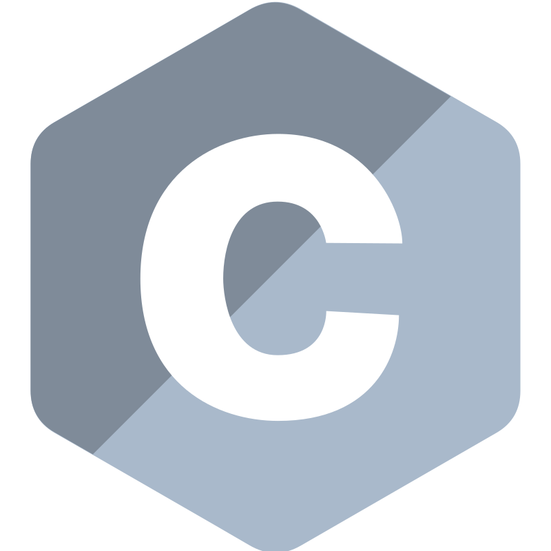
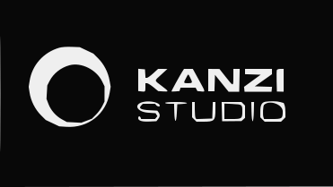
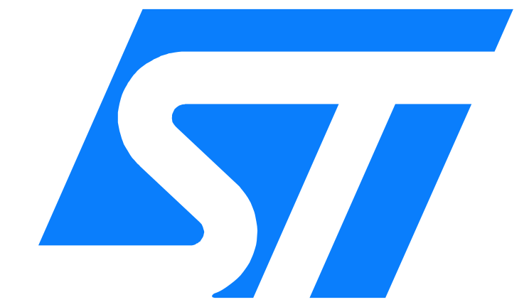
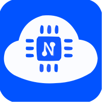
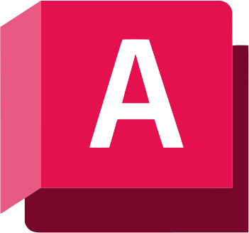

<h3>Hi, I am Bohdan, Software Engineer from Ukraine.</h3>

  Currently working on several cross-platform (Windows, Linux) projects using C++, CMake, Qt, GoogleTest:

<a href="https://github.com/callmebohdan/minipass">minipass</a>
<a>A minimalistic password generator featuring customizable settings.</a>

<a href="https://github.com/callmebohdan/nomaren">nomaren</a>
<a>A cross-platform media player capable of handling music, pictures, videos, and text.</a>

<h3>🔗 Contacts:</h3>

<h3>🛠 Skills:</h3>
<h4>Networking:</h4>

<h4>Virtualization:</h4>

<h4>Human-Machine Interface:</h4>

<h4>Linux:</h4>

<h4>Build Systems:</h4>

<h4>Version Control:</h4>

<h4>Design:</h4>

<h4>Project Management:</h4>

<h4>Documentation:</h4>

<h3>Contact me:</h3>

<h3>Primary Skills:</h3>

<h3>Secondary Skills:</h3>

<h3>Additional Skills:</h3>

<h3>⚙️ GitHub Analytics:</h3>

